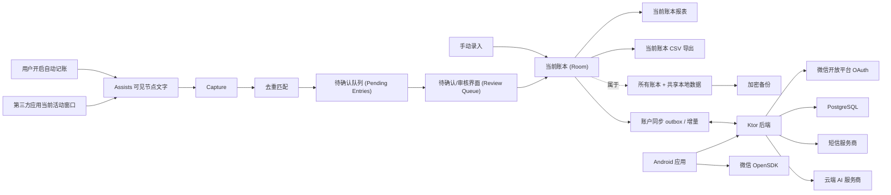

# 架构设计草案 (Architecture Draft)

## 1. 系统形态

本产品是一款**本地优先 (Local-first)** 的 Android 应用，配有一个后端，用于处理统一标识认证、设备注册、云端配置、账户级账本同步、短信/邮件验证、账号注销以及 AI 分类代理/日志记录。

Room 是设备端离线真实源；用户明确启用后，后端按账号保存可读的正式同步范围，并作为多设备共享中心。待确认、已忽略和采集证据仍只属于设备端；默认资金账户作为独立账号配置同步。

## 2. Android 应用模块划分

推荐模块设计：
- `app`: Android 入口、导航路由与依赖注入组装。
- `core:model`: 共享领域模型。
- `core:database`: Room 实体、DAO 与数据库迁移。
- `core:security`: 本地加密辅助工具与备份加解密。
- `core:permissions`: 权限状态与设备设置引导。
- `feature:review`: 待确认队列及待确认条目详情。
- `feature:ledger`: 账本列表、搜索、筛选与条目详情。
- `feature:reports`: 月度概览、分类占比与分类趋势。
- `feature:billsync`: Assists 无障碍事件接入、受限节点遍历、通用页面解析、去重及待确认交接。
- `feature:categorization`: 本地分类规则及 AI 分类客户端。
- `feature:account`: 用户名/邮箱/手机号与微信登录注册、公开账号 UUID、账号 Profile、身份绑定/换绑与合并、Session、本地模式及账号注销。
- `feature:settings`: 数据与备份及相关设置。
- `feature:sync`: 账户同步协调器、HTTPS 客户端、Room outbox、远端应用器与 WorkManager 调度。
- `feature:diagnostics`: 敏感事件契约、密钥脱敏、加密本地分段、诊断 UI、清除及口令导出。

确保捕获解析与去重逻辑脱离 Android UI 即可进行单元测试。

### 数据层与状态解耦架构（2026-07-22 重构）
- **领域仓储 (Domain Repositories)**：数据持久化划分为严格的领域接口：
  - `LedgerBookRepository`: 账本的增删改查 (CRUD) 及活动选择。
  - `LedgerEntryRepository`: 活动与软删除条目的生命周期管理及保留期清理。
  - `FundingAccountRepository`: 跨账本共享资金账户管理。
  - `LocalLedgerRepository`: 实现上述所有领域接口，作为 UI 和 ViewModel 调用的单一门面 (Facade)。
- **UI 状态与服务协调器**：
  - `BksAppState`: 统一管理顶层 Tab、个人中心子页面、手动录入入口、列表滚动状态及 `SnackbarHostState`；`MainActivity` 只保留系统生命周期、外部 Intent 转换和 `setContent`。
  - `BksAppBindings` 承载系统权限、设置跳转、外部导航及微信回调，`BksAppOverrides` 仅承载测试替身；生产依赖、Session 恢复、同步副作用和本地状态持久化继续由应用根组合层统一装配。
  - 审核编辑器、账本列表、账本表单模型和账号管理对话框分别位于独立文件，Screen 入口只负责页面状态与事件编排。
  - `BillSyncAccessibilityService` 继承 `AssistsService`，只保留 Service 生命周期、事件过滤、500 ms 稳定等待、活动窗口复核、节点文本边界和 30 秒防抖；`onDestroy` 取消任务并注销 Listener。
- **第三轮根组合重构（2026-08-02）**：`BksApp` 保留为唯一根组合入口，但将职责拆分为可独立核对的边界：
  - `BksAppDependencies` 负责 Room、账号、AI、微信、备份和账本同步等生产依赖的记忆化装配；`BksAppOverrides` 只向测试注入替身，不改变生产依赖图。
  - `BksAppRuntime` 集中账号 Session、账本/同步状态、动作和展示模型；`BksAppEffectsContext` 及其副作用函数集中恢复、校验、导航、持久化和同步生命周期，避免路由组件直接拥有后台任务。
  - `BksRouteContext` 作为路由共享上下文，`BksRouteHost` 负责账号入口、已登录应用壳、手动录入和主 Tab 分发；账本/待确认/报表与 Profile 子页分别由 `BksLedgerRoutes`、`BksProfileRoutes` 编排。
  - `BksLedgerSyncAccountSwitchDialog` 必须在 `BksTheme` 组合结束后调用。这样账本同步发现账号与本地 Profile 不一致时，AlertDialog 继续使用重构前的主题作用域，不会因结构拆分意外继承应用自定义颜色、字体或组件主题。
- **第四轮 Ledger + Review UI 职责拆分（2026-08-02）**：保持产品交互、Room/同步、OCR、后端契约和数据语义不变，将核心页面拆成可独立核对的渲染与编排边界：
  - Ledger 表单字段与配置位于 `LedgerEntryFormFields.kt`、`LedgerEntryFormConfig.kt`；最近删除、账本管理和资金账户管理分别位于独立 Screen 文件，`LedgerScreen` 只负责路由和 action holder 装配。
  - Review 列表、忽略项弹窗和编辑器工具分别位于 `ReviewQueueListContent.kt`、`ReviewIgnoredEntriesDialog.kt`、`ReviewEditorTools.kt`；`ReviewQueueScreen` 与 `ReviewQueueEditor` 保留页面状态和事件编排。
  - 账本和资金账户删除操作由管理页的长生命周期 Compose scope 启动；删除对话框只发送确认事件。删除完成或失败后，Snackbar 不会因为对话框移出组合而被取消，成功/失败路径由 `LedgerReportsScreenTest` 覆盖。
  - Android Detekt baseline 从 128 项减少到 112 项，已移除 16 个本轮解决或搬迁的问题；`ReviewQueueScreen` 的公开入口参数债务为兼容现有调用方暂时保留。
- **第五轮账本同步后端职责拆分（2026-08-02）**：保持 HTTP/JSON、共享 API、数据库 schema、事务边界、账号删除门控和同步数据语义不变，收缩后端同步内部职责：
  - `LedgerSyncValidation.kt` 集中请求参数和 mutation 合同校验；`LedgerSyncService` 只保留删除门控、Store 编排和领域结果映射。
  - `LedgerSyncMutationNormalizer.kt` 由 JDBC 与 InMemory Store 共用业务唯一键规范化和引用重映射；`InMemoryLedgerSyncMutationOperations.kt` 承担内存 mutation、冲突、幂等结果与 revision 操作，外层 `@Synchronized` 方法继续持有唯一同步锁。
  - `LedgerSyncRoutes.kt` 只负责五个同步 endpoint 的注册与认证/解析边界；`LedgerSyncRouteResponses.kt` 统一成功和错误 JSON envelope；`JdbcLedgerSyncStore` 使用 `AcceptedRecordWrite` 聚合写入参数，SQL 和事务实现保持不变。
  - 后端 Detekt baseline 移除本轮已解决的 8 条同步问题；同步专项 16 项、Backend 全量 212 项（3 项环境门控跳过）和 Android 全量 556 项均无失败，`coverageReport detekt build` 通过。
- **第六轮 Provider 与 AI 服务职责拆分（2026-08-02）**：保持账号验证码、AI 分类、HTTP/JSON、环境变量、数据库 schema、日志隐私边界和失败语义不变，只收缩后端内部职责：
  - `SmtpEmailProviderConfig` 与 `AliyunPnvsSmsConfig` 承载 SMTP/阿里云 PNVS 的不可变配置；`SmtpEmailProvider`、`AliyunPnvsSmsProvider` 保留原 public 构造器作为兼容转发入口，环境变量名称、短信 Provider 选择值、凭据回退顺序、TLS/超时和失败映射均不变。
  - `AiCategorizationService` 只负责请求编排、Provider 调用和成功日志写入；`AiCategorizationValidation.kt` 负责请求与增强上下文授权校验，`AiCategorizationResponseValidation.kt` 负责响应白名单、脱敏解释和异常映射。取消异常继续向上传播，未知运行时异常稳定映射为 `PROVIDER_ERROR`，任何失败都不写成功日志或泄露 Provider 文本。
  - 本轮未新增路由、共享 API、环境变量、数据库表或用户流程。Backend 全量测试 213 项（3 项环境门控跳过）和 backend Detekt 通过；baseline 现仅保留 `AccountRoutesTest` 的 `LargeClass` 历史项。Android 全量、`coverageReport`、根构建和真机验收未因本轮 backend-only 改动重复执行。
- **通用页面识别（2026-08-21）**：`BillPageParser` 是唯一解析入口，要求完成态、唯一金额、无冲突方向和交易上下文；平台专用分类器、字段提取器、OCR 与手动会话已删除。
- **第八轮 分类规则页面职责拆分（2026-08-03）**：保持规则匹配语义、规则持久化、AI 同意状态与可见 UI 行为不变，只拆分 `CategorizationRulesScreen` 的页面职责：
  - 规则列表、规则编辑对话框和 AI 设置区段分别位于 `CategorizationRuleListContent.kt`、`CategorizationRuleDialog.kt`、`CategorizationAiSettingsSection.kt`，`CategorizationAiUiState.kt` 承载 AI 设置状态；`CategorizationRulesScreen` 保留页面状态与装配。
  - 本轮未新增共享 API、数据库表或后端路由，Detekt baseline 无变化。
- **第九轮 微信账号管理 UI 职责拆分（2026-08-03）**：保持账号 Profile 持久化、微信身份绑定/换绑/合并、注销冷静期与可见 UI 行为不变，只拆分 `AccountManagementScreen` 的微信账号管理职责：
  - `WechatAccountManagement.kt` 保留微信账号管理面板的状态与事件编排；昵称/头像 Profile 内容、头像编辑、身份对话框宿主及对话框操作分别位于 `WechatAccountProfileContent.kt`、`WechatAccountAvatarEditor.kt`、`WechatAccountIdentityDialogHost.kt`、`WechatAccountIdentityDialogOperations.kt`。
  - Android Detekt baseline 移除 5 条已解决的 `WechatAccountManagement.kt` 问题；账号专项测试（含新增微信 UI 覆盖）通过。
- **第十轮 账号入口职责拆分（2026-08-03）**：保持 `AccountScreen` 公开签名、页面返回层级、Session 持久化失败撤销、微信回调单次消费、短信倒计时与 Snackbar 生命周期不变，只拆分账号入口文件职责：
  - `AccountScreen.kt` 保留 Compose 状态、微信 Controller 装配、跨页面 Effects、返回处理和子组件装配；认证操作（`isReadyFor`、短信请求、登录、注册、找回及 `completeAuthentication`）机械搬移至 `AccountAuthOperations.kt`。
  - 页面模型、Flow 页 Scaffold 与 Landing/Login/Register/Recovery/LocalMode 内容位于 `AccountAuthContent.kt`；表单字段组件因 Detekt 文件级 `TooManyFunctions` 阈值独立为 `AccountAuthFormFields.kt`；微信登录分支 Scaffold 包装 `WechatLoginFlowPage` 归入 `WechatLoginScreens.kt`。
  - Android Detekt baseline 从 101 项减少到 98 项，移除 3 条已解决的 `AccountScreen.kt` 问题，公开入口的 `LongParameterList` 兼容债务保留。账号专项测试、Android 全量单元测试、`assembleDebug`、`coverageReport detekt build` 均通过，未执行真机操作。
- **第十一轮 数据与备份页面职责拆分（2026-08-03）**：保持账户同步模式与冲突规则、备份格式与恢复事务、CSV 契约与删除语义不变，只拆分 `DataAndBackupScreen` 的账户同步与本地备份职责：
  - `LedgerSyncSettingsSection.kt` 拥有同步区稳定生命周期内的 `syncBusy`、首次同步预览与确认 Dialog、冲突展示；`LocalBackupSection.kt` 拥有文件 Launcher、导出/导入密码、`PendingRestore` 与恢复确认；`DataAndBackupScreen.kt` 保留公开签名、页面标题/返回、共享 `SnackbarHostState` 与危险区。
  - 协程 scope 由 Section 持有，Dialog 关闭后成功/失败 Snackbar 不会被取消；Android Detekt baseline 从 98 项减少到 96 项，移除两条已解决的 `CyclomaticComplexMethod`/`LongMethod`，公开入口与 `BackupPasswordDialog` 的 `LongParameterList` 兼容债务保留。
  - settings 专项、Android 全量单元测试、`assembleDebug`、`coverageReport detekt build` 均通过，未执行真机操作。
- **第十二轮 诊断日志页面职责拆分（2026-08-03）**：保持诊断采集范围、脱敏、加密分段、清空与导出口令语义不变，只拆分 `DiagnosticLogsScreen` 的页面内容与 Dialog 职责：
  - `DiagnosticLogsContent.kt` 拥有事件列表、搜索/级别/组件筛选、状态与操作行及 `DiagnosticEventCard`，只接收状态和事件回调；`DiagnosticLogsDialogs.kt` 承载 Release 开启确认、敏感内容确认、清空确认、导出口令与导出结果 Dialog。
  - 导出 Job 继续由页面级 scope 持有，口令在 `finally` 中以 `\u0000` 覆盖，取消不创建文件，结果 Dialog 在口令 Dialog 关闭后仍可见；Lifecycle 后台重新遮罩与 `FLAG_SECURE` 边界保留在根函数。
  - Android Detekt baseline 从 96 项减少到 94 项，移除两条已解决的 `CyclomaticComplexMethod`/`LongMethod`，公开入口的 `LongParameterList` 兼容债务保留；新增导出失败后结果仍稳定可见的 UI 回归测试。
  - diagnostics/compliance 专项、Android 全量单元测试、`assembleDebug`、`coverageReport detekt build` 均通过，未执行真机操作。
- **第二十四轮全项目收口重构（2026-08-05）**：保持产品 UI、Room/PostgreSQL schema、Shared API、HTTP/JSON、备份格式、同步事务与识别规则不变，只删除重复基础逻辑并收缩职责边界：
  - `AppVisuals.kt` 将壁纸与装饰图片缓存收敛为同一私有实现，容量和对外行为分别保留；`BackendTransportPolicy.kt` 让 AI 设置、AI 分类和 Ledger Sync 共用同一私网 HTTP 测试主机判定。
  - `ReportsScreen.kt` 保留路由与 Overview；分类圆环/排行和现金流面板分别位于 `ReportsCategoryBreakdown.kt`、`ReportsCashFlow.kt`，入口签名、绘制算法、语义节点和布局参数不变。
  - `PersistedLocalDataBackup.kt` 保留 Snapshot/Repository 和恢复事务；校验、加密口令、版本 Codec、实体/元数据编码分别位于 settings 下的职责文件，V2/V3/V4 读取、字段顺序和错误语义不变。
  - `LedgerSyncLocalStore.kt` 保留既有 Facade 和事务边界；记录应用、快照/outbox 操作、payload 映射和排序分别外提，`LedgerSyncCoordinator` 将同步拆为 push/pull 步骤，canonical remap、冲突、cursor 和调用顺序不变。Facade 的既有 `TooManyFunctions` 兼容 suppression 保留，未新增其他 suppression。
  - Backend `AccountRoutesTest` 按 Session/Profile、限流、注销、微信和 Identifier 拆为五个路由测试类；未新增测试 Harness，生产代码不变。
  - Android Detekt baseline 从 71 项降至 66 项，Backend 从 1 项降至 0 项；Shared API 7 项、Macrobenchmark 2 项保留，合计从 81 项降至 75 项。本轮专项测试、Android/Backend Detekt、根 `detekt build` 均通过；Android 全量 577 项、Backend 全量 213 项（3 项环境门控跳过）无失败，未执行真机操作。
- **第二十五轮微信账号服务收口重构（2026-08-05）**：保持产品 UI、Room/PostgreSQL schema、Shared API、HTTP/JSON、备份格式、同步事务和微信账号结果语义不变，只收缩单一调用方职责：
  - `WechatAccountService.exchangeWechatCode()` 保留配置/输入校验、OAuth code 交换、用户资料回退、UnionID/OpenID 查找和结果分派；已验证 Session、无 Session 已有身份登录、新身份 `WECHAT_AUTH` 一次性票据及 MergeRequired 处理收口到同文件私有 helper，Session、设备、资料更新和身份 claim 顺序不变。
  - `PersistedLocalDataBackupValidationSupport.kt` 的校验小逻辑回并到 `PersistedLocalDataBackupValidation.kt`；`LedgerSyncSnapshotOperationsSupport.kt` 的 push result 与 business-key canonicalization 逻辑回并到 `LedgerSyncSnapshotOperations.kt`，outbox、metadata、canonical remap、冲突和排序语义不变。
  - 本轮未新增路由、Shared API、环境变量、数据库 schema、UI、事务外壳、Detekt baseline 或 suppression；未执行真机操作。
- **静态代码质量检查**：
  - 通过自动化 Detekt 静态分析 (`config/detekt/detekt.yml`)，在所有 Kotlin 模块中强制约束类最大长度（600 行）、圈复杂度上限及空 catch 块检查。
  - 各叶子模块保存已知问题 baseline，`maxIssues=0`，因此历史问题可逐步消除而任何新增问题都会使构建失败。

## 3. 本地数据模型

核心数据表：
- `pending_entries`: 已捕获但等待审核的候选条目。
- `ledger_books`: 具有稳定 ID 和创建时间戳的具名本地账本。
- `ledger_entries`: 活动及软删除的账本条目，每个条目精准属于一个账本，包含流向、当前用户字段、不可变的捕获溯源信息（若存在）及生命周期时间戳。
- `capture_events`: 来源证据、捕获原因、置信度状态、原始文本引用或加密原始文本。
- `dedupe_links`: 重复候选对象与合并条目之间的关联关系。
- `categories`: 用户分类。
- `categorization_rules`: 商家/标题/来源/交易类型的匹配规则。
- `funding_accounts`: 跨账本共享的可复用资金账户（来源透出或用户创建）；手动账户的支付来源可为空。
- `ignored_entries`: 已忽略的待确认条目，保留 30 天可恢复。
- `local_settings`: 当前账本 ID、AI 同意状态、增强上下文同意状态及连续同步设置。
- `account_sync_state`、`account_sync_metadata`、`account_sync_outbox`、`account_sync_conflicts`: 账号绑定、游标、记录版本、持久化待上传变更及人工冲突；不包含 Token。
- `backup_metadata`: 备份时间戳与恢复历史记录。

敏感本地数据处理：
- 将账本、原始证据、商家/标题、金额、分类、资金账户及 AI 请求 Payload 均视为**敏感交易信息**。
- 对于备份以及存储在普通应用私有数据库保障之外的任何原始证据，使用加密手段保护。

账本生命周期约束（Invariants）：
- 手动导入的候选对象在进入账本前始终先进入全局待确认队列；用户手动撰写的条目在表单校验通过后可直接写入当前账本。
- 当前账本 ID 持久化保存。手动创建与确认待确认条目在开始写入前即锁定目标账本 ID，防止并发切换账本导致条目写入错位。
- 报表、CSV 导出、活动账目查询及最近删除查询均以当前账本为作用域。待确认条目、已忽略条目、分类和去重保持全局作用域。
- 每个账本条目都有一个指向某个账本的非空外键约束。从单账本 Schema 升级的设备会自动创建固定“默认账本”记录，并将活动与软删除条目均归属于它。
- 应用始终至少保留一个账本。仅当账本既无活动条目也无软删除条目时才允许删除；在同一个事务中删除当前空账本会自动选择最早创建的剩余账本。
- 分类和资金账户在所有账本间共享。更新资金账户不会变更其标识符；只有当没有活动/已删除的账本条目、待确认条目或已忽略条目引用它时，才允许删除。
- 确认待确认条目会保留现有的资金账户 ID；否则仅复用名称规范化匹配且支付来源精准一致的账户，绝不自动创建新账户。
- 金额保持为正数最小单位整数（分）。独立的资金流向决定流入、流出或中性报表行为。
- 编辑修改当前用户可见字段时，不得覆盖原始捕获来源、条目来源、待确认条目引用、首次确认时间或保留的捕获证据。
- 溯源信息与生命周期字段保持持久化，但 Release 版 UI 不组装调试元数据区域；Debug 版条目详情可在上下文展示它。
- 软删除条目排除在当前账本的活动查询、CSV 及报表之外，在 30 天内可在该账本中恢复，过期后永久移除。
- Room v5 到 v6 迁移与加密备份 V4 会保留账本归属。V2/V3 备份导入会将旧条目映射入“默认账本”；账本 ID 与引用校验在任何恢复事务修改本地数据前完成，且恢复时优先于依赖条目插入账本。
- 清除本地数据将重新创建一个空的“默认账本”，并将其设置为当前账本。

账户同步合并约束：
- 全新安装生成、且仍与当前内置模板一致的系统分类和初始分类规则只作为启动数据。首次绑定已有云端 Profile 时直接采用云端规范记录，不把安装时间戳或内置模板版本差异排入 outbox 或人工冲突。
- 拉取到旧客户端已产生的同类冲突时，若本机候选仍是未编辑的内置模板，则应用云端版本并清除本机冲突；用户实际修改过的内置记录仍按普通并发修改保留人工冲突。
- 该例外只适用于可验证的系统分类和初始分类规则，不扩展到默认账本或其他正式数据，避免覆盖已有账目关系。

## 4. 捕获流水线 (Capture Pipeline)

流水线阶段：
1. `AssistsService.listeners` 接收窗口状态、内容或窗口集合变化事件。
2. 500 ms 后通过 `AssistsCore.getAccessibilityRootNodes(ActiveWindow)` 复核包名与窗口，并受限采集可读节点文字。
3. `BillPageParser` 在内存中执行通用完成态、金额、方向和上下文准入。
4. `BillSyncPipeline` 生成 `OTHER` / `ACCESSIBILITY_AUTO` / `NEEDS_REVIEW` 候选并执行既有去重。
5. 本地分类规则应用后，`ReviewQueuePersistence` 创建或合并待确认条目。
6. 用户确认后才由 Repository 写入当前账本。

核心规则：
- 捕获流水线**绝不直接写入**已确认的账本条目。
- `BillSyncCaptureProcessor` 通过 `ReviewQueuePersistence` 进行持久化，应用 UI 从 Room Flow 实时刷新。
- 原始页面文字、未命中内容和无关页面信息不进入 Room、诊断日志、备份、同步或上传链路。
- 初始本地规则作为可编辑的 Room 记录预置；数据库迁移与首次安装回调不得覆盖用户后续的修改。

## 5. 去重匹配 (Deduplication)

高置信度合并条件：
- 相同的来源订单号（若存在）。
- 来源、金额、商家/标题、交易时间及交易类型强匹配。

低置信度重复候选对象：
- 金额与时间相近，但商家/标题较弱。
- 同一笔支付产生了不同的来源文本。
- 类似于支付对的退款或转账模式。

低置信度重复项进入待确认队列由用户判断。

## 6. AI 分类 (AI Categorization)

客户端行为：
- 本地规则优先。
- 云端 AI 默认关闭。
- 需要用户登录并明确提供 AI 同意。
- 默认采用最小化 Payload。
- 仅在用户选择开启后才提供增强 AI 上下文。

后端行为：
- Android 应用仅通过 `BuildConfig.BKS_BACKEND_URL` 调用本项目的 `POST /ai/categorize`，Bearer Token 不得转发给第三方 Provider。
- 路由先验证 Session、云写入状态、已保存的 AI 同意及独立的增强上下文同意；注销冷静期账号在读取 payload 前即被阻断。
- 运行时环境工厂通过 `BKS_AI_PROTOCOL=openai-responses|openai-chat-completions|anthropic-messages` 选择协议。三种协议共用 `BKS_AI_ENDPOINT`、`BKS_AI_API_KEY`、`BKS_AI_MODEL`、认证方式和超时配置；Endpoint 必须包含完整请求路径。旧的厂商专属环境变量不再读取。空值、`rule`、未知协议或配置错误均失败关闭。`RuleBasedAiProvider` 仅可由测试代码直接注入，不得通过环境配置选择。所有外部请求仅允许 HTTPS，HTTP 仅限 localhost 测试。
- 认证方式限定为 `bearer`、`x-api-key` 或 `api-key`。结构化输出支持协议允许的 `json-schema`、`json-object` 或 `prompt-only`；Chat Completions 还可显式启用或关闭推理模式。服务端始终再次校验响应长度、字段集合、置信度枚举及分类候选白名单。
- 只有完整验证成功的建议才写入最小化 AI 日志；Provider 缺失、超时、限流、HTTP/解析失败及白名单失败均不写成功日志。
- AI 日志仅保存账号关联、最小请求字段、建议及时间；使用增强上下文时，Provider explanation 也不持久化，改存固定脱敏说明。备注和原始证据不落库，也不进入普通日志、错误响应或 Provider 异常文本。
- AI 日志不等于云端账本同步，日志留存策略必须在公开发布前经过复核。

建议的最小化 AI Payload：
- 商家/标题。
- 交易类型。
- 支付来源。
- 金额区间（非精准金额）。
- 现有的分类候选清单。

若用户开启增强上下文，可包含更完整的标题、备注、来源细节或相邻交易线索。

## 7. 后端服务 (Backend Services)

Ktor 服务构成：
- **认证服务 (Auth Service)**：内部账号 ID、公开账号 UUID、账号 Profile、用户名/邮箱/手机号共享密码、微信 OAuth、身份绑定/换绑与合并、安全解绑、Session 校验及当前 Session 退出登录。刷新 Token 和固定 Token 过期不包含在本版本中。
- **验证码服务 (Verification Service)**：按手机号或邮箱分发短信/SMTP 验证码，并统一处理用途隔离、过期、错误次数及限流。
- **设备服务 (Device Service)**：已注册设备及设备状态管理。
- **云端配置服务 (Cloud Config Service)**：同意状态、功能开关、AI 设置及注销冷静期状态。
- **AI 分类代理服务 (AI Categorization Service)**：向 AI 服务商转发请求并保留内测日志。
- **账本同步服务 (Ledger Sync Service)**：提供初始化、分页快照、幂等推送、游标增量拉取和冲突解决，并按 `accountId` 隔离。
- **账号注销服务 (Account Deletion Service)**：注销申请、冷静期状态管理、取消注销及最终清理任务。
- **合规服务 (Compliance Service)**：提供隐私政策、收集清单、第三方清单及权限说明。

账号持久化边界：
- `AccountStore` 保持统一兼容门面，并组合账号生命周期、标识/Profile、验证码、Session/设备、微信身份和跨账号事务能力。
- `AccountService` 保持 Routes 使用的公共门面，内部委派给验证码、标识账号、微信账号、Session 和生命周期五个服务；公开方法、默认参数、环境工厂和错误映射保持兼容。
- `JdbcAccountStore` 保持稳定构造门面。内部能力组件共享 `JdbcAccountStoreContext`；微信注册/绑定/解绑和账号合并由事务组件创建唯一连接，并把同一个 `Connection` 显式传给身份、设备、账本同步和云配置迁移 SQL。
- JDBC 仅将确认的唯一键冲突映射为领域冲突；其他 `SQLException` 在事务回滚后继续抛出。
- `InMemoryAccountStore` 作为与 JDBC 语义一致的测试实现，所有能力组件共享一个 `InMemoryAccountState` 和同一把锁，复合身份操作不会使用分离的数据副本。

PostgreSQL 数据表：
- `accounts`：内部自增 `account_id` 与对外稳定 `public_id` UUID。
- `account_profiles`：账号级昵称、头像值及更新时间。
- `account_password_credentials`
- `account_identifiers`
- `account_wechat_identities`
- `account_one_time_tickets`
- `verification_codes`
- `verification_code_send_logs`
- `account_sessions`
- `registered_devices`
- `cloud_config`
- `ai_categorization_logs`
- `ledger_sync_profiles`、`ledger_sync_records`、`ledger_sync_changes`、`ledger_sync_mutations`、`ledger_sync_conflicts`

## 8. 账号与安全 (Account And Security)

密码策略：
- 8-32 个字符。
- 必须包含大写字母、小写字母、数字和符号。
- 使用现代密码哈希算法存储密码。

Session 与传输边界：
- Android 应用在构建时获取后端 URL。Debug 默认使用 `http://10.0.2.2:8080`；Debug 与 Release 均可使用显式配置的 HTTP 或 HTTPS URL，Release 未配置 URL 时保持账号网络不可用。HTTP 仅用于受控测试网络和专用测试账号，因为账号凭据、验证码与 Session Token 不具备传输加密。
- 账本同步、AI 分类及云端 AI 设置同步默认拒绝 HTTP；仅当本地忽略配置 `BKS_ALLOW_HTTP_LEDGER_SYNC=true` 且目标为回环或 RFC1918 地址时允许受控测试。账本同步界面持续显示明文风险；生产网络调用必须使用 HTTPS。
- Android 网络请求在 IO 调度器上使用 `HttpURLConnection`，连接超时 10 秒，读取超时 15 秒。注册、登录、验证码、退出登录及注销操作不会自动重试。
- 受保护路由仅通过 `Authorization: Bearer` 解析身份；客户端提交的标识或表单 Token 绝不用于选取受保护账号。
- 验证码哈希包含标识类型、规范化值、用途和验证码，并以 `BKS_AUTH_PEPPER` 为密钥使用 HMAC-SHA-256 存储；随机 Session Token 仅以 SHA-256 哈希值存储。密码与验证码比较采用恒定时间字节比较。
- Android 在专用偏好设置中使用 Android Keystore AES-GCM 保存 Session v5：业务 Token、公开账号 UUID、主标识、全部登录标识、微信绑定状态、注销状态、昵称和头像值；继续读取旧 v1-v4 Session，并在下一次保存时升级。密文排除在 Room、账本备份、诊断和日志之外。随机持久化的安装 UUID 取代硬件标识符。
- 启动时在后台校验前先恢复加密凭据。网络/配置故障保留离线未校验 Session 和本地账本访问权；仅当显式收到无效 Session 时才清除密文并返回持久化本地模式。
- 微信 OpenSDK 仅使用可公开 AppID。AppSecret、微信 access/refresh token、OpenID、UnionID 和 Provider 原始响应不进入 APK、Android Session、日志或诊断导出；授权 code 只发送自有后端并立即从回调 Intent 移除。
- 微信授权、标识绑定及账号合并票据有效期均为 5 分钟、只能消费一次，数据库只保存 SHA-256 哈希。绑定、合并和解绑轮换业务 Session；Android 保存新 Session 失败时尝试撤销新 Token 并回到本地模式。

身份与合并边界：
- 账号内部以数据库自增 `accountId` 关联 Session、设备、云配置和 AI 日志；对外使用不可变 `accountUuid` 供展示和复制。两者都不能替代 Bearer Token 进行认证。
- 每个账号至多绑定一个用户名、一个邮箱、一个手机号和一个微信身份，所有密码标识共享一份密码与锁定状态。补绑与换绑共用验证码和五分钟单次票据；换绑必须显式标记并在事务中替换同类型旧标识。
- 用户名、邮箱和手机号按统一解析规则规范化；v6 在单事务中将 v5 手机号凭据迁移为账号级密码凭据和 `PHONE` 标识。
- 微信身份优先用 UnionID 识别，缺失时使用唯一 `(appId, openid)`；每次成功授权刷新昵称和 HTTPS 头像 URL。
- 账号级 `account_profiles` 优先于微信资料提供显示昵称和头像。`POST /account/profile/nickname` 与 `POST /account/profile/avatar` 只接受 Bearer 身份；昵称最多 20 个字符，头像仅接受签名和大小均合法、解码后不超过 256 KiB 的 JPEG/PNG Data URL。
- Android 相册与相机入口共用单源 `ImageDecoder`，在 IO 调度器上缩放为最长边 256 像素并压缩为 JPEG；相机临时文件只通过未导出的 `FileProvider` 授予单次 URI 权限，读取后删除。
- 合并仅用于微信纯账号与已有密码账号的互补凭据，并始终保留当前账号；密码账号之间发生标识冲突时禁止转移或合并。当前配置优先、来源独有开关补入、设备按安装 UUID 去重、来源 AI 日志删除；同步记录迁移到目标账号，同一记录的不同版本保留为冲突；双方旧 Session 撤销并删除来源账号。
- 解绑微信要求账号仍有密码凭据及至少一个登录标识，可使用共享密码，或选择已绑定手机号/邮箱接收专项验证码。身份操作不删除 Android Room 账本；只有用户确认换账号时才原子替换正式同步范围。

登录失败处理：
- 从任一绑定标识连续 5 次密码错误后，账号级密码凭据临时锁定 15 分钟，并建议使用手机号或邮箱找回。
- 登录错误信息绝不透露标识是否存在。

验证码限制：
- 同一规范化手机号或邮箱：60 秒内 1 条，1 小时内 5 条，24 小时内 10 条。
- 同一设备/IP：1 小时内 5 条，24 小时内 10 条。
- 验证码有效期：5 分钟。
- 同一验证码：尝试失败 3 次后作废。

账号注销：
- 7 天冷静期。
- 冷静期内：允许登录、同步读取和取消注销，暂停云端 AI、设备配置及账本同步写入；本机 outbox 继续保留。
- 执行清理时：以幂等方式先删除 AI 日志、云端配置和全部同步 Profile/记录/增量/幂等结果/冲突；仅当清理成功后，才删除账号、设备及 Session。清理失败将保留等待中账号以便后续重试。
- 清除所有本地账本仍属于独立的受保护本地数据操作。

## 9. 权限架构 (Permission Architecture)

自动记账页面分别追踪用户意图开关、无障碍授权状态和服务实时连接状态。权限或连接断开不反写用户开关。

重要边界：
- 现行判断条件统一记录在[通用交易识别规则](./PAYMENT-RECOGNITION-RULES.md)。
- Service 排除 BKS 自身，只读取可见、非密码、非可编辑文字，限制 512 节点、24 层和 16 KiB。
- Service 不截图、不执行 OCR、不点击、不滚动、不启动应用，也不按微信/支付宝包名建立白名单或路由。
- 付款发起、密码输入、待支付、处理中、失败、取消以及金额/方向冲突优先拒绝。
- Manifest 保持 `exported=false`，无 `packageNames` 和 `canTakeScreenshot`；微信包查询仅供微信登录。

## 10. 敏感诊断日志 (Sensitive Diagnostic Logging)

通用自动记账的诊断边界详见 [ADR 0063](./adr/0063-replace-platform-capture-with-assists-generic-recognition.md)；运维指南见 [DIAGNOSTIC-LOGS.md](./DIAGNOSTIC-LOGS.md)。

- `feature/diagnostics` 拥有事件契约、身份凭证脱敏、256 KB 事件上限、5 秒抑制、Android Keystore 加密、`.aadlog` 分段、查询、清除及 `.aadiag` 导出能力。
- 自动记账链路不向 `DiagnosticRecorder` 写入页面内容、拒绝内容或交易字段；当前生产者仅记录应用异常。
- 每个 JSON 事件在独立使用随机 AES-GCM IV 加密前均已脱敏并限制大小。文件存放在 `noBackupFilesDir` 下，使用 1 MB 分段，且仅当密文总大小超过 10 MB 时才滚动删除最旧分段。
- Debug 默认开启。Release 默认关闭并要求知情用户确认。关闭开关保留历史；清除操作会删除所有分段及 Keystore 密钥。
- 账本 V5 备份与诊断导出共享 PBKDF2-HMAC-SHA256/AES-256-GCM 原语，但保留独立的机制前缀与格式：`AUTO_ACCOUNTING_BACKUP_V5:` 与 `AUTO_ACCOUNTING_DIAGNOSTICS_V1:`。
- Logcat 仅接收元数据、稳定原因、计数及相关性 ID。敏感 Payload 及完整异常消息绝不出在 Logcat 中。

## 11. 构建与验证目标 (Build And Verification Targets)

Android 端检查：
- 解析器、规范化器、去重逻辑与分类规则的单元测试。
- Room 数据库迁移测试。
- 可行时对关键界面进行 Compose UI 截图测试。
- 实用条件下的权限状态与本地数据库流程仪表化测试。

后端检查：
- 统一标识、密码策略、短信/邮件验证码限流、注销状态机的单元测试。
- 基于 PostgreSQL 测试容器或本地测试数据库的集成测试。
- 应用/后端 API Payload 的契约测试。

内测手动检查：
- 自动记账四种页面状态、授权入口和开关/权限分离。
- 通用页面准入、拒绝条件、待确认持久化与原始文字不落盘。
- 诊断日志开关、脱敏生命周期、加密导出/解密和清除语义。
- 备份导出与导入。
- 账号注销冷静期与取消注销流程。
- Session 持久化失败、离线重启、显式无效 Session、当前 Session 退出登录失败、Bearer 防冒充及哈希凭据迁移。
