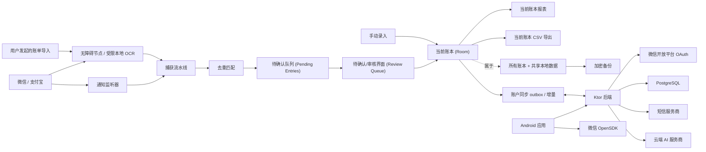

# 架构设计草案 (Architecture Draft)

## 1. 系统形态

本产品是一款**本地优先 (Local-first)** 的 Android 应用，配有一个后端，用于处理统一标识认证、设备注册、云端配置、账户级账本同步、短信/邮件验证、账号注销以及 AI 分类代理/日志记录。

Room 是设备端离线真实源；用户明确启用后，后端按账号保存可读的正式同步范围，并作为多设备共享中心。待确认、已忽略、采集证据和设备设置仍只属于设备端。

## 2. Android 应用模块划分

推荐模块设计：
- `app`: Android 入口、导航路由与依赖注入组装。
- `core:model`: 共享领域模型。
- `core:database`: Room 实体、DAO 与数据库迁移。
- `core:security`: 本地加密辅助工具与备份加解密。
- `core:permissions`: 权限状态与设备设置引导。
- `feature:review`: 待确认队列及待确认条目详情。
- `feature:ledger`: 账本列表、搜索、筛选与条目详情。
- `feature:reports`: 月度概览、分类占比与分类趋势。
- `feature:capture-notification`: 通知监听服务集成。
- `feature:capture-accessibility`: 支付结果自动捕获与手动账单导入。
- `feature:billsync`: 共享的 `ManualBillImportHost`、导入会话状态、来源启动、受支持页面解析及无障碍捕获接管。
- `feature:categorization`: 本地分类规则及 AI 分类客户端。
- `feature:account`: 用户名/邮箱/手机号与微信登录注册、身份绑定与合并、Session、本地模式及账号注销。
- `feature:monitoring`: 自动记账状态、紧凑权限与后台稳定性设置、服务健康度及支付页面观察决策。
- `feature:settings`: 数据与备份及相关设置。
- `feature:sync`: 账户同步协调器、HTTPS 客户端、Room outbox、远端应用器与 WorkManager 调度。
- `feature:diagnostics`: 敏感事件契约、密钥脱敏、加密本地分段、诊断 UI、清除及口令导出。

确保捕获解析与去重逻辑脱离 Android UI 即可进行单元测试。

### 数据层与状态解耦架构（2026-07-22 重构）
- **领域仓储 (Domain Repositories)**：数据持久化划分为严格的领域接口：
  - `LedgerBookRepository`: 账本的增删改查 (CRUD) 及活动选择。
  - `LedgerEntryRepository`: 活动与软删除条目的生命周期管理及保留期清理。
  - `FundingAccountRepository`: 跨账本共享资金账户管理。
  - `LocalLedgerRepository`: 实现上述所有领域接口，作为 UI 和 ViewModel 调用的单一门面 (Facade)。
- **UI 状态与服务协调器**：
  - `MonitoringStateCoordinator`: 封装 Android Activity 生命周期回调、服务心跳定时器 (`Handler`) 及设置 Intent 启动器。
  - `AutoAccountingAppState`: 管理 Compose 导航 Tab 列表、列表滚动状态及 SnackbarHostState 的状态持有者 (State Holder)。
- **静态代码质量检查**：
  - 通过自动化 Detekt 静态分析 (`config/detekt/detekt.yml`)，在所有 Kotlin 模块中强制约束类最大长度（600 行）、圈复杂度上限及空 catch 块检查。

## 3. 本地数据模型

核心数据表：
- `pending_entries`: 已捕获但等待审核的候选条目。
- `ledger_books`: 具有稳定 ID 和创建时间戳的具名本地账本。
- `ledger_entries`: 活动及软删除的账本条目，每个条目精准属于一个账本，包含流向、当前用户字段、不可变的捕获溯源信息（若存在）及生命周期时间戳。
- `capture_events`: 来源证据、捕获原因、置信度状态、原始文本引用或加密原始文本。
- `dedupe_links`: 重复候选对象与合并条目之间的关联关系。
- `categories`: 用户分类。
- `categorization_rules`: 商家/标题/来源/交易类型的匹配规则。
- `funding_accounts`: 跨账本共享的可复用资金账户（来源透出或用户创建）；手动账户的支付来源可为空。
- `ignored_entries`: 已忽略的待确认条目，保留 30 天可恢复。
- `local_settings`: 当前账本 ID、AI 同意状态、增强上下文同意状态及连续同步/监控设置。
- `account_sync_state`、`account_sync_metadata`、`account_sync_outbox`、`account_sync_conflicts`: 账号绑定、游标、记录版本、持久化待上传变更及人工冲突；不包含 Token。
- `backup_metadata`: 备份时间戳与恢复历史记录。

敏感本地数据处理：
- 将账本、原始证据、商家/标题、金额、分类、资金账户及 AI 请求 Payload 均视为**敏感交易信息**。
- 对于备份以及存储在普通应用私有数据库保障之外的任何原始证据，使用加密手段保护。

账本生命周期约束（Invariants）：
- 自动捕获的候选对象在进入账本前始终先进入全局待确认队列；用户手动撰写的条目在表单校验通过后可直接写入当前账本。
- 当前账本 ID 持久化保存。手动创建与确认待确认条目在开始写入前即锁定目标账本 ID，防止并发切换账本导致条目写入错位。
- 报表、CSV 导出、活动账目查询及最近删除查询均以当前账本为作用域。待确认条目、已忽略条目、分类和去重保持全局作用域。
- 每个账本条目都有一个指向某个账本的非空外键约束。从单账本 Schema 升级的设备会自动创建固定“默认账本”记录，并将活动与软删除条目均归属于它。
- 应用始终至少保留一个账本。仅当账本既无活动条目也无软删除条目时才允许删除；在同一个事务中删除当前空账本会自动选择最早创建的剩余账本。
- 分类和资金账户在所有账本间共享。更新资金账户不会变更其标识符；只有当没有活动/已删除的账本条目、待确认条目或已忽略条目引用它时，才允许删除。
- 确认待确认条目会保留现有的资金账户 ID；否则仅复用名称规范化匹配且支付来源精准一致的账户，绝不自动创建新账户。
- 金额保持为正数最小单位整数（分）。独立的资金流向决定流入、流出或中性报表行为。
- 编辑修改当前用户可见字段时，不得覆盖原始捕获来源、条目来源、待确认条目引用、首次确认时间或保留的捕获证据。
- 溯源信息与生命周期字段保持持久化，但 Release 版 UI 不组装调试元数据区域；Debug 版条目详情可在上下文展示它。
- 软删除条目排除在当前账本的活动查询、CSV 及报表之外，在 30 天内可在该账本中恢复，过期后永久移除。
- Room v5 到 v6 迁移与加密备份 V4 会保留账本归属。V2/V3 备份导入会将旧条目映射入“默认账本”；账本 ID 与引用校验在任何恢复事务修改本地数据前完成，且恢复时优先于依赖条目插入账本。
- 清除本地数据将重新创建一个空的“默认账本”，并将其设置为当前账本。

## 4. 捕获流水线 (Capture Pipeline)

流水线阶段：
1. 来源事件从通知监听器、自动无障碍捕获或手动账单导入到达。
2. 解析器 (Parser) 提取候选字段与原始证据。
3. 规范化器 (Normalizer) 将来源特定文本映射为交易类型、商家/标题、金额、时间、资金账户及来源。
4. 去重模块 (Deduplication) 与待确认条目及账本条目进行对比。
5. 分类模块 (Categorization) 先应用本地规则，随后可选用 AI 分类。
6. 创建待确认条目或执行合并。
7. 刷新待确认队列。

核心规则：
- 捕获流水线**绝不直接写入**已确认的账本条目。
- 手动导入 UI 本身绝不直接写入或合并待确认条目。`BillSyncCaptureProcessor` 通过 `ReviewQueuePersistence` 进行持久化，应用 UI 从 Room Flow 实时刷新。
- 初始本地规则作为可编辑的 Room 记录预置；数据库迁移与首次安装回调不得覆盖用户后续的修改。

## 5. 去重匹配 (Deduplication)

高置信度自动合并条件：
- 相同的来源订单号（若存在）。
- 来源、金额、商家/标题、交易时间及交易类型强匹配。
- 同一笔交易已知对应的“通知捕获 - 手动导入”对。

低置信度重复候选对象：
- 金额与时间相近，但商家/标题较弱。
- 同一笔支付产生了不同的来源文本。
- 类似于支付对的退款或转账模式。

低置信度重复项进入待确认队列由用户判断。

## 6. AI 分类 (AI Categorization)

客户端行为：
- 本地规则优先。
- 云端 AI 默认关闭。
- 需要用户登录并明确提供 AI 同意。
- 默认采用最小化 Payload。
- 仅在用户选择开启后才提供增强 AI 上下文。

后端行为：
- Android 应用仅调用本项目的后端。
- 后端负责调用 AI 服务商。
- 内测期间后端保留 AI 分类日志。
- AI 日志不等于云端账本同步。
- 日志留存策略必须在公开发布前经过复核。

建议的最小化 AI Payload：
- 商家/标题。
- 交易类型。
- 支付来源。
- 金额区间（非精准金额）。
- 现有的分类候选清单。

若用户开启增强上下文，可包含更完整的标题、备注、来源细节或相邻交易线索。

## 7. 后端服务 (Backend Services)

Ktor 服务构成：
- **认证服务 (Auth Service)**：内部账号 ID、用户名/邮箱/手机号共享密码、微信 OAuth、身份绑定与合并、安全解绑、Session 校验及当前 Session 退出登录。刷新 Token 和固定 Token 过期不包含在本版本中。
- **验证码服务 (Verification Service)**：按手机号或邮箱分发短信/SMTP 验证码，并统一处理用途隔离、过期、错误次数及限流。
- **设备服务 (Device Service)**：已注册设备及设备状态管理。
- **云端配置服务 (Cloud Config Service)**：同意状态、功能开关、AI 设置及注销冷静期状态。
- **AI 分类代理服务 (AI Categorization Service)**：向 AI 服务商转发请求并保留内测日志。
- **账本同步服务 (Ledger Sync Service)**：提供初始化、分页快照、幂等推送、游标增量拉取和冲突解决，并按 `accountId` 隔离。
- **账号注销服务 (Account Deletion Service)**：注销申请、冷静期状态管理、取消注销及最终清理任务。
- **合规服务 (Compliance Service)**：提供隐私政策、收集清单、第三方清单及权限说明。

PostgreSQL 数据表：
- `accounts`
- `account_password_credentials`
- `account_identifiers`
- `account_wechat_identities`
- `account_one_time_tickets`
- `verification_codes`
- `verification_code_send_logs`
- `account_sessions`
- `registered_devices`
- `cloud_config`
- `ai_categorization_logs`
- `ledger_sync_profiles`、`ledger_sync_records`、`ledger_sync_changes`、`ledger_sync_mutations`、`ledger_sync_conflicts`

## 8. 账号与安全 (Account And Security)

密码策略：
- 8-32 个字符。
- 必须包含大写字母、小写字母、数字和符号。
- 使用现代密码哈希算法存储密码。

Session 与传输边界：
- Android 应用在构建时获取后端 URL。Debug 默认使用 `http://10.0.2.2:8080`；Debug 与 Release 均可使用显式配置的 HTTP 或 HTTPS URL，Release 未配置 URL 时保持账号网络不可用。HTTP 仅用于受控测试网络和专用测试账号，因为账号凭据、验证码与 Session Token 不具备传输加密。
- 账本同步单独默认拒绝 HTTP；仅当本地忽略配置 `AUTO_ACCOUNTING_ALLOW_HTTP_LEDGER_SYNC=true` 且目标为回环或 RFC1918 地址时允许受控测试，并在界面持续显示明文风险。生产同步必须使用 HTTPS。
- Android 网络请求在 IO 调度器上使用 `HttpURLConnection`，连接超时 10 秒，读取超时 15 秒。注册、登录、验证码、退出登录及注销操作不会自动重试。
- 受保护路由仅通过 `Authorization: Bearer` 解析身份；客户端提交的标识或表单 Token 绝不用于选取受保护账号。
- 验证码哈希包含标识类型、规范化值、用途和验证码，并以 `AUTO_ACCOUNTING_AUTH_PEPPER` 为密钥使用 HMAC-SHA-256 存储；随机 Session Token 仅以 SHA-256 哈希值存储。密码与验证码比较采用恒定时间字节比较。
- Android 在专用偏好设置中使用 Android Keystore AES-GCM 保存 Session v3：业务 Token、主标识、全部登录标识、微信绑定状态、昵称和 HTTPS 头像 URL；继续读取旧 v1/v2 Session，并在下一次保存时升级。密文排除在 Room、账本备份、诊断和日志之外。随机持久化的安装 UUID 取代硬件标识符。
- 启动时在后台校验前先恢复加密凭据。网络/配置故障保留离线未校验 Session 和本地账本访问权；仅当显式收到无效 Session 时才清除密文并返回持久化本地模式。
- 微信 OpenSDK 仅使用可公开 AppID。AppSecret、微信 access/refresh token、OpenID、UnionID 和 Provider 原始响应不进入 APK、Android Session、日志或诊断导出；授权 code 只发送自有后端并立即从回调 Intent 移除。
- 微信授权、标识绑定及账号合并票据有效期均为 5 分钟、只能消费一次，数据库只保存 SHA-256 哈希。绑定、合并和解绑轮换业务 Session；Android 保存新 Session 失败时尝试撤销新 Token 并回到本地模式。

身份与合并边界：
- 账号内部以 `accountId` 关联 Session、设备、云配置和 AI 日志；每个账号至多绑定一个用户名、一个邮箱、一个手机号和一个微信身份，所有密码标识共享一份密码与锁定状态。
- 用户名、邮箱和手机号按统一解析规则规范化；v6 在单事务中将 v5 手机号凭据迁移为账号级密码凭据和 `PHONE` 标识。
- 微信身份优先用 UnionID 识别，缺失时使用唯一 `(appId, openid)`；每次成功授权刷新昵称和 HTTPS 头像 URL。
- 合并仅用于微信纯账号与已有密码账号的互补凭据，并始终保留当前账号；密码账号之间发生标识冲突时禁止转移或合并。当前配置优先、来源独有开关补入、设备按安装 UUID 去重、来源 AI 日志删除；同步记录迁移到目标账号，同一记录的不同版本保留为冲突；双方旧 Session 撤销并删除来源账号。
- 解绑微信要求账号仍有密码凭据及至少一个登录标识，可使用共享密码，或选择已绑定手机号/邮箱接收专项验证码。身份操作不删除 Android Room 账本；只有用户确认换账号时才原子替换正式同步范围。

登录失败处理：
- 从任一绑定标识连续 5 次密码错误后，账号级密码凭据临时锁定 15 分钟，并建议使用手机号或邮箱找回。
- 登录错误信息绝不透露标识是否存在。

验证码限制：
- 同一规范化手机号或邮箱：60 秒内 1 条，1 小时内 5 条，24 小时内 10 条。
- 同一设备/IP：1 小时内 5 条，24 小时内 10 条。
- 验证码有效期：5 分钟。
- 同一验证码：尝试失败 3 次后作废。

账号注销：
- 7 天冷静期。
- 冷静期内：允许登录、同步读取和取消注销，暂停云端 AI、设备配置及账本同步写入；本机 outbox 继续保留。
- 执行清理时：以幂等方式先删除 AI 日志、云端配置和全部同步 Profile/记录/增量/幂等结果/冲突；仅当清理成功后，才删除账号、设备及 Session。清理失败将保留等待中账号以便后续重试。
- 清除所有本地账本仍属于独立的受保护本地数据操作。

## 9. 权限架构 (Permission Architecture)

权限中心追踪状态：
- 通知监听服务状态。
- 用于自动捕获与手动账单导入的无障碍服务状态。
- 自动捕获开启状态。
- 无障碍服务连接心跳。
- 可检测的电池优化与省电模式状态。
- 非阻断性后台运行与厂商特定自启动引导（不假定这些状态可以完全可靠读取）。

重要边界：
- 通知监听器仅从微信/支付宝的支付通知中创建待确认条目。
- 自动无障碍捕获仅在显式开启后运行，并仅观察白名单中的支付结果或支付记录页面；它不需要先进行手动导入或获得通知监听权限。
- 自动捕获优先读取无障碍节点。空白微信无障碍界面可使用一次性临时截图配合内置本地 OCR：Android 14 及以上仅捕获活动应用窗口，Android 11-13 使用屏幕截图 API。Bitmap 在识别后立即释放，绝不持久化或上传。原始 OCR 文本不进入账本数据库；单独开启的加密诊断存储仅在接受的支付界面或活动手动导入会话中可保留文本。
- 手动账单导入保持由用户主动发起，不属于常规支付流程。
- 空白微信应用页面仅当当前导入会话携带显式 OCR 同意时才允许进入手动 OCR 路径。这覆盖了当前可见的微信历史账单详情页，而不依赖特定的 Activity 类；自动 OCR 保持其较窄的信任 Activity 列表。
- 手动 OCR 仅接受字段关系 `当前状态: 支付成功`（同行或相邻键值行）以及一个无歧义的交易金额。`确认支付`、`立即支付`、`收银台`、`支付密码`、`待支付`、`处理中`、`支付失败` 和 `已取消` 属于硬性否定，优先于正面证据。
- 接受的历史详情在存在时保留规范化支付方式、商品/收据备注、商品标题、商家/收款方、状态、交易时间、交易订单号及商家订单号。Bitmap 保持临时性；原始 OCR 文本保持在账本之外，且仅在单独开启的加密诊断存储中为活动手动导入会话持久化。
- 待确认队列与自动记账分发同一个应用级导入请求；两者均不持有独立的会话对话框或持久化路径。
- 权限授予与在线服务连接是独立的先决条件。缺失条件会阻止来源启动并透出恢复操作。
- 每次导入仅读取当前受支持的可见页面。它不会进行自动导航、滚动、翻页或承诺完整的历史扫描。
- 90 秒超时仅会导致处于 `AwaitingBillPage` 状态的同一会话失败；处理中、已取消、已完成及较新的会话不受影响。
- 在 Android 13 及以上版本，记账结果通知权限在开启自动记账时申请；拒绝授权不得阻止本地捕获或持久化。
- 应用绝对不得读取聊天内容、发送消息、发起支付或发起转账。

## 10. 敏感诊断日志 (Sensitive Diagnostic Logging)

约束性决策详见 [ADR 0055](./adr/0055-store-opt-in-sensitive-diagnostics-on-device.md)；运维与生产者指南见 [DIAGNOSTIC-LOGS.md](./DIAGNOSTIC-LOGS.md)。

- `feature/diagnostics` 拥有事件契约、身份凭证脱敏、256 KB 事件上限、5 秒抑制、Android Keystore 加密、`.aadlog` 分段、查询、清除及 `.aadiag` 导出能力。
- 服务与处理器在通知/无障碍/OCR/解析器/去重/持久化之间传递随机 `traceId`。手动导入额外使用现有的 `sessionId`；候选 ID 绝不复用为 Trace ID，因为它们可能编码了交易数据。
- 生产者尽力发送回调给 `DiagnosticRecorder`。记录器/存储故障仅透出固定元数据错误，绝不导致捕获、去重或持久化失败。
- 每个 JSON 事件在独立使用随机 AES-GCM IV 加密前均已脱敏并限制大小。文件存放在 `noBackupFilesDir` 下，使用 1 MB 分段，且仅当密文总大小超过 10 MB 时才滚动删除最旧分段。
- Debug 默认开启。Release 默认关闭并要求知情用户确认。关闭开关保留历史；清除操作会删除所有分段及 Keystore 密钥。
- 账本 V4 备份与诊断导出共享 PBKDF2-HMAC-SHA256/AES-256-GCM 原语，但保留独立的机制前缀与格式：`AUTO_ACCOUNTING_BACKUP_V4:` 与 `AUTO_ACCOUNTING_DIAGNOSTICS_V1:`。
- Logcat 仅接收元数据、稳定原因、计数及相关性 ID。敏感 Payload 及完整异常消息绝不出在 Logcat 中。

## 11. 构建与验证目标 (Build And Verification Targets)

Android 端检查：
- 解析器、规范化器、去重逻辑与分类规则的单元测试。
- Room 数据库迁移测试。
- 可行时对关键界面进行 Compose UI 截图测试。
- 实用条件下的权限状态与本地数据库流程仪表化测试。

后端检查：
- 统一标识、密码策略、短信/邮件验证码限流、注销状态机的单元测试。
- 基于 PostgreSQL 测试容器或本地测试数据库的集成测试。
- 应用/后端 API Payload 的契约测试。

内测手动检查：
- 多个国产 ROM 设备上的微信/支付宝通知捕获。
- 从待确认队列入口发起的具有共享预检、90 秒超时和清晰分步进度的手动账单导入。
- 自动支付结果捕获开关及结果通知。
- 诊断日志开关、脱敏生命周期、加密导出/解密、清除语义及支付作用域拒绝。
- 备份导出与导入。
- 账号注销冷静期与取消注销流程。
- Session 持久化失败、离线重启、显式无效 Session、当前 Session 退出登录失败、Bearer 防冒充及哈希凭据迁移。
