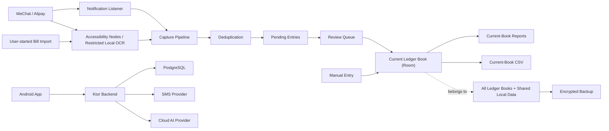

# Architecture Draft

## 1. System Shape

The product is a local-first Android app with a small backend for identity, device registration, cloud configuration, SMS verification, account deletion, and AI categorization proxy/logging.

The Android app owns all ledger-book truth. The first backend must not sync or store the user's ledger books or entries.

## 2. Android App Modules

Recommended modules:
- `app`: Android entry point, navigation, dependency wiring.
- `core:model`: shared domain models.
- `core:database`: Room entities, DAO, migrations.
- `core:security`: local encryption helpers and backup crypto.
- `core:permissions`: permission state, device setting guidance.
- `feature:review`: review queue and pending-entry detail.
- `feature:ledger`: ledger list, search, filters, entry detail.
- `feature:reports`: monthly overview, category share, category trend.
- `feature:capture-notification`: notification listener integration.
- `feature:capture-accessibility`: automatic payment-result capture and manual bill import.
- `feature:billsync`: shared `ManualBillImportHost`, import session state, source launch, supported-page parsing, and accessibility capture handoff.
- `feature:categorization`: local rules and AI categorization client.
- `feature:account`: login, registration, recovery, local mode, deletion.
- `feature:monitoring`: automatic-bookkeeping state, compact permission and background-reliability settings, service health, and payment-surface observation decisions.
- `feature:settings`: data/backup and related profile settings.
- `feature:diagnostics`: sensitive event contract, secret redaction, encrypted local segments, diagnostic UI, clear, and passphrase export.

Keep capture parsing and deduplication testable without Android UI.

### Data Layer & State Decoupling Architecture (2026-07-22 Refactoring)
- **Domain Repositories**: Data persistence is partitioned into strict domain interfaces:
  - `LedgerBookRepository`: ledger book CRUD and active selection.
  - `LedgerEntryRepository`: active and soft-deleted entry lifecycle and retention purging.
  - `FundingAccountRepository`: cross-ledger shared funding account management.
  - `LocalLedgerRepository`: implements all domain interfaces as a single Facade for UI and ViewModel compatibility.
- **UI State & Service Coordinators**:
  - `MonitoringStateCoordinator`: encapsulates Android Activity lifecycle callbacks, service heartbeat timers (`Handler`), and Settings intent launchers.
  - `AutoAccountingAppState`: Compose State Holder managing navigation tab lists, list scroll states, and SnackbarHostState.
- **Static Quality Enforcement**:
  - Automated Detekt static analysis (`config/detekt/detekt.yml`) enforces maximum class length (600 lines), cyclomatic complexity limits, and empty-catch blocks across all Kotlin modules.

## 3. Local Data Model

Core tables:
- `pending_entries`: captured candidates awaiting review.
- `ledger_books`: named local ledger books with stable IDs and creation timestamps.
- `ledger_entries`: active and soft-deleted ledger entries, each assigned to exactly one ledger book, with flow direction, current user fields, immutable capture provenance where available, and lifecycle timestamps.
- `capture_events`: source evidence, capture reason, confidence state, raw text reference or encrypted raw text.
- `dedupe_links`: relationships between duplicate candidates and merged entries.
- `categories`: user categories.
- `categorization_rules`: merchant/title/source/kind matching rules.
- `funding_accounts`: reusable source-reported or user-created funding accounts shared across ledger books; payment source may be absent for manual accounts.
- `ignored_entries`: ignored pending entries with 30-day retention.
- `local_settings`: current ledger-book ID, AI consent, enhanced-context consent, and continuous-sync or monitoring settings.
- `backup_metadata`: backup timestamps and restore history.

Sensitive local data:
- Treat ledger, raw evidence, merchant/title, amount, category, funding account, and AI request payloads as sensitive transaction information.
- Use encryption for backups and for any raw evidence stored outside ordinary app-private database guarantees.

Ledger lifecycle invariants:
- Automatically captured candidates still enter the global review queue before a ledger book; a user-authored manual entry may be written directly to the current ledger book after form validation.
- The current ledger-book ID is persisted. Manual creation and pending-entry confirmation capture their target ledger-book ID before starting the write so a concurrent selection change cannot redirect the entry.
- Reports, CSV export, active ledger queries, and recently deleted queries are scoped to the current ledger book. Pending entries, ignored entries, categorization, and deduplication remain global.
- Every ledger entry has a non-null restricted foreign key to one ledger book. An installation upgrading from the single-ledger schema creates the fixed "默认账本" record and assigns both active and soft-deleted entries to it.
- The app always retains at least one ledger book. A ledger book is deletable only when it has neither active nor soft-deleted entries; deleting the current empty ledger book selects the earliest-created remaining book in the same transaction.
- Categories and funding accounts are shared across ledger books. Funding accounts are updated without replacing their identity and are deletable only when no active/deleted ledger entry, pending entry, or ignored entry references them.
- Pending-entry confirmation preserves an existing funding-account ID; otherwise it may reuse only an exact normalized-name and payment-source match and must not auto-create an account.
- Amounts remain positive minor-unit integers. Independent flow direction determines inflow, outflow, or neutral reporting behavior.
- Editing changes current user-visible fields without overwriting original capture source, entry origin, pending-entry reference, first confirmation time, or retained capture evidence.
- Provenance and lifecycle fields remain persisted, but Release UI does not compose the debug-metadata section; Debug entry detail may display it in context.
- Soft-deleted entries are excluded from the current book's active queries, CSV, and reports, remain recoverable within that book for 30 days, and are then permanently removed.
- Room v5-to-v6 migration and encrypted-backup V4 preserve ledger ownership. V2/V3 backup import maps legacy entries into "默认账本"; validation of book IDs and references completes before any restore transaction changes local data, and restore inserts ledger books before dependent entries.
- Clearing local data recreates exactly one empty "默认账本" and stores it as the current ledger book.

## 4. Capture Pipeline

Pipeline stages:
1. Source event arrives from notification listener, automatic accessibility capture, or manual bill import.
2. Parser extracts candidate fields and raw evidence.
3. Normalizer maps source-specific text into transaction kind, merchant/title, amount, time, funding account, and source.
4. Deduplication compares against pending entries and ledger entries.
5. Categorization applies local rules, then optional AI.
6. Pending entry is created or merged.
7. Review queue updates.

Key rule:
- The capture pipeline never writes directly to confirmed ledger entries.
- Manual import UI never writes or merges pending entries itself. `BillSyncCaptureProcessor` persists through `ReviewQueuePersistence`, and app UI refreshes from the Room Flow.
- Initial local rules are seeded as editable Room records; migrations and first-install callbacks must not overwrite later user edits.

## 5. Deduplication

High-confidence auto-merge:
- Same source order id, if available.
- Strong match on source, amount, merchant/title, transaction time, and kind.
- Known notification-to-manual-import pair for the same source transaction.

Low-confidence duplicate candidate:
- Similar amount and time but weak merchant/title.
- Different source text for what may be the same payment.
- Refund or transfer patterns that can resemble payment pairs.

Low-confidence duplicates go to review.

## 6. AI Categorization

Client behavior:
- Local rules first.
- Cloud AI disabled by default.
- Login and explicit AI consent required.
- Minimal payload by default.
- Enhanced AI context only after user opts in.

Backend behavior:
- App calls only the project backend.
- Backend calls AI provider.
- Backend keeps AI categorization logs during internal beta.
- AI logs are not cloud ledger sync.
- Logging retention must be reviewed before public submission.

Suggested minimal AI payload:
- Merchant/title.
- Transaction kind.
- Payment source.
- Amount range, not necessarily exact amount.
- Existing category candidates.

Enhanced context may include more complete title, note, source detail, or nearby transaction hints if the user opts in.

## 7. Backend Services

Ktor services:
- Auth service: phone/password login, registration, password recovery, Session verification, and current-Session logout. Refresh tokens and fixed token expiry are not part of this version.
- SMS verification service: issue, verify, expire, and rate-limit codes.
- Device service: registered devices and device state.
- Cloud configuration service: consent, feature flags, AI settings, deletion-pending state.
- AI categorization service: proxy request to AI provider and retain beta logs.
- Account deletion service: deletion request, cooling-off state, cancel deletion, final deletion job.
- Compliance service: serve privacy policy, collection list, third-party list, permission explanations.

PostgreSQL tables:
- `account_users`
- `account_password_credentials`
- `account_sms_codes`
- `account_sms_issues`
- `account_sessions`
- `registered_devices`
- `cloud_config`
- `ai_categorization_logs`

## 8. Account And Security

Password policy:
- 8-32 characters.
- Must include uppercase letters, lowercase letters, numbers, and symbols.
- Store passwords with a modern password hash.

Session and transport boundary:
- Android receives the backend URL at build time. Debug defaults to `http://10.0.2.2:8080` and is the only build that permits cleartext traffic; Release uses only an explicitly configured HTTPS URL and otherwise keeps account networking unavailable.
- Android network calls use `HttpURLConnection` on the IO dispatcher with 10-second connect and 15-second read timeouts. Registration, login, SMS, logout, and deletion actions are not retried automatically.
- Protected routes resolve identity only from `Authorization: Bearer`; client-submitted phone numbers or form tokens never select the protected account.
- SMS codes are stored as HMAC-SHA-256 values keyed by `AUTO_ACCOUNTING_AUTH_PEPPER`; random Session tokens are stored only as SHA-256 hashes. Password and verification comparisons use constant-time byte comparison.
- Android encrypts phone and token together with Android Keystore AES-GCM in dedicated preferences. They are excluded from Room, ledger backup, diagnostics, logs, and rendered UI. A random persisted installation UUID replaces hardware identifiers.
- Startup restores encrypted credentials before verifying them in the background. Network/configuration failures retain an offline-unverified Session and local ledger access; only an explicit invalid Session clears ciphertext and returns to persistent local mode.

Login failure:
- After 5 consecutive password failures, temporarily lock login and suggest SMS recovery.
- Login error must not reveal whether the phone number exists.

SMS limits:
- Same phone: 1 per 60 seconds, 5 per hour, 10 per 24 hours.
- Same device/IP: 5 per hour, 10 per 24 hours.
- Code validity: 5 minutes.
- Same code: 3 failed attempts then invalidated.

Account deletion:
- 7-day cooling-off period.
- During cooling-off: login allowed, cancel allowed, cloud AI and device config writes paused.
- At execution: idempotently delete AI logs and cloud config first; only after both succeed delete the account, devices, and Sessions. A cleanup failure retains the pending account for a later retry.
- Deleting all local ledger books remains a separate protected local-data action.

## 9. Permission Architecture

Permission center tracks:
- Notification listener state.
- Accessibility service state for automatic capture and manual bill import.
- Automatic capture enabled state.
- Accessibility-service connection heartbeat.
- Detectable battery-optimization and battery-saver state.
- Non-blocking background-running and manufacturer-specific auto-start guidance, without pretending these states are reliably readable.

Important boundaries:
- Notification listener only creates pending entries from WeChat/Alipay payment notifications.
- Automatic accessibility capture runs only after explicit opt-in and observes allowlisted payment-result or payment-record pages; it does not require a prior manual import or notification-listener access.
- Automatic capture reads accessibility nodes first. A blank WeChat accessibility surface may use one transient screenshot with bundled local OCR: Android 14 or later captures only the active app window, while Android 11-13 uses the display screenshot API. The bitmap is released after recognition and is never persisted or uploaded. Raw OCR text does not enter the ledger database; the separately enabled encrypted diagnostic store may retain text only for an accepted payment surface or active manual-import session.
- Manual bill import remains user-started and is not part of the normal payment flow.
- A blank WeChat application page may enter the manual OCR path only when the current import session carries explicit OCR consent. This covers currently visible WeChat history-bill detail pages without depending on a specific Activity class; automatic OCR keeps its narrower trusted-activity list.
- Manual OCR accepts only the field relationship `当前状态: 支付成功` (same line or adjacent key/value lines) together with one unambiguous transaction amount. `确认支付`, `立即支付`, `收银台`, `支付密码`, `待支付`, `处理中`, `支付失败`, and `已取消` are hard denials and win over positive evidence.
- Accepted history details preserve normalized payment method, product/receipt note, product title, merchant/payee, status, transaction time, transaction order id, and merchant order id when present. The bitmap remains transient; raw OCR text remains outside the ledger and may persist only in the separately enabled encrypted diagnostic store for the active manual-import session.
- Review Queue and Automatic Bookkeeping dispatch the same app-level import request; neither owns a separate session dialog or persistence path.
- Permission grant and live service connection are independent preconditions. A missing condition prevents source launch and exposes recovery actions.
- Each import reads only the current supported visible page. It does not navigate, scroll, paginate, or promise a full history scan.
- A 90-second timeout can fail only the same session while it remains in `AwaitingBillPage`; processing, cancelled, completed, and newer sessions are unaffected.
- On Android 13 or later, result-notification permission is requested when automatic bookkeeping is enabled; denial must not prevent local capture or persistence.
- The app must not read chat content, send messages, initiate payments, or initiate transfers.

## 10. Sensitive Diagnostic Logging

The binding decision is [ADR 0055](./adr/0055-store-opt-in-sensitive-diagnostics-on-device.md); operator and producer guidance lives in [DIAGNOSTIC-LOGS.md](./DIAGNOSTIC-LOGS.md).

- `feature/diagnostics` owns the event contract, authentication-secret redaction, 256 KB event cap, 5-second suppression, Android Keystore encryption, `.aadlog` segmentation, querying, clearing, and `.aadiag` export.
- Services and processors pass a random `traceId` through notification/accessibility/OCR/parser/dedupe/persistence. Manual import additionally uses the existing `sessionId`; candidate IDs are never reused as trace IDs because they can encode transaction data.
- Producers call `DiagnosticRecorder` best-effort. Recorder/storage failures emit only a fixed metadata error and never fail capture, dedupe, or persistence.
- Each JSON event is redacted and size-limited before being independently encrypted with a random AES-GCM IV. Files live under `noBackupFilesDir`, use 1 MB segments, and rotate oldest segments only after total ciphertext exceeds 10 MB.
- Debug defaults enabled. Release defaults disabled and requires informed user confirmation. Closing the switch keeps history; clear deletes all segments and the Keystore key.
- The ledger V4 backup and diagnostic export share the PBKDF2-HMAC-SHA256/AES-256-GCM primitive but retain separate prefixes and formats: `AUTO_ACCOUNTING_BACKUP_V4:` and `AUTO_ACCOUNTING_DIAGNOSTICS_V1:`.
- Logcat receives metadata, stable reasons, counts, and correlation IDs only. Sensitive payloads and full exception messages never go to Logcat.

## 11. Build And Verification Targets

Android checks:
- Unit tests for parsers, normalizers, dedupe, categorization rules.
- Room migration tests.
- Compose UI screenshot tests for key screens when feasible.
- Instrumented tests for permission state and local database flows where practical.

Backend checks:
- Unit tests for auth, password policy, SMS limits, deletion state machine.
- Integration tests with PostgreSQL test container or local test database.
- Contract tests for app/backend API payloads.

Manual beta checks:
- WeChat/Alipay notification capture on several domestic Android ROMs.
- Manual bill import from the Review Queue entry with shared preflight, 90-second timeout, and clear stepwise progress.
- Automatic payment-result capture opt-in/off switch and result notifications.
- Diagnostic opt-in, masking lifecycle, encrypted export/decryption, clear semantics, and payment-scope rejection.
- Backup export/import.
- Account deletion cooling-off and cancel flow.
- Session persistence failure, offline restart, explicit invalid Session, current-Session logout failure, Bearer anti-impersonation, and hashed credential migration.
