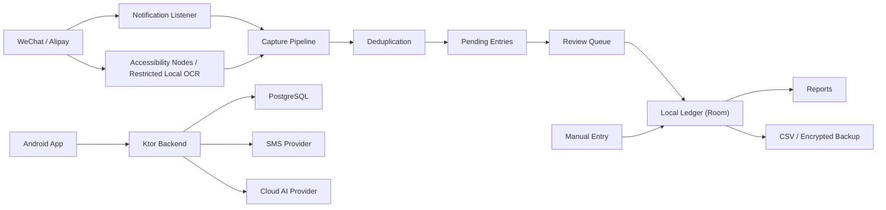

# Architecture Draft

## 1. System Shape

The product is a local-first Android app with a small backend for identity, device registration, cloud configuration, SMS verification, account deletion, and AI categorization proxy/logging.

The Android app owns ledger truth. The first backend must not sync or store the user's full ledger.

## 2. Android App Modules

Recommended modules:
- `app`: Android entry point, navigation, dependency wiring.
- `core:model`: shared domain models.
- `core:database`: Room entities, DAO, migrations.
- `core:security`: local encryption helpers and backup crypto.
- `core:permissions`: permission state, device setting guidance.
- `feature:review`: review queue and pending-entry detail.
- `feature:ledger`: ledger list, search, filters, entry detail.
- `feature:reports`: monthly overview, category share, category trend.
- `feature:capture-notification`: notification listener integration.
- `feature:capture-accessibility`: automatic payment-result capture and manual bill sync.
- `feature:categorization`: local rules and AI categorization client.
- `feature:account`: login, registration, recovery, local mode, deletion.
- `feature:settings`: profile, permission center, backup/export, compliance pages.

Keep capture parsing and deduplication testable without Android UI.

## 3. Local Data Model

Core tables:
- `pending_entries`: captured candidates awaiting review.
- `ledger_entries`: active and soft-deleted ledger entries with flow direction, current user fields, immutable capture provenance where available, and lifecycle timestamps.
- `capture_events`: source evidence, capture reason, confidence state, raw text reference or encrypted raw text.
- `dedupe_links`: relationships between duplicate candidates and merged entries.
- `categories`: user categories.
- `categorization_rules`: merchant/title/source/kind matching rules.
- `funding_accounts`: reusable source-reported or user-created funding accounts; payment source may be absent for manual accounts.
- `ignored_entries`: ignored pending entries with 30-day retention.
- `settings`: local mode, permission flags, feature flags, AI consent cache.
- `backup_metadata`: backup timestamps and restore history.

Sensitive local data:
- Treat ledger, raw evidence, merchant/title, amount, category, funding account, and AI request payloads as sensitive transaction information.
- Use encryption for backups and for any raw evidence stored outside ordinary app-private database guarantees.

Ledger lifecycle invariants:
- Automatically captured candidates still enter the review queue before the ledger; a user-authored manual entry may be written directly to the ledger after form validation.
- Amounts remain positive minor-unit integers. Independent flow direction determines inflow, outflow, or neutral reporting behavior.
- Editing changes current user-visible fields without overwriting original capture source, entry origin, pending-entry reference, first confirmation time, or retained capture evidence.
- Soft-deleted entries are excluded from active queries, CSV, and reports, remain recoverable for 30 days, and are then permanently removed.
- Room migrations and encrypted-backup format upgrades must preserve existing ledger data and support importing the prior backup version.

## 4. Capture Pipeline

Pipeline stages:
1. Source event arrives from notification listener, automatic accessibility capture, or manual bill sync.
2. Parser extracts candidate fields and raw evidence.
3. Normalizer maps source-specific text into transaction kind, merchant/title, amount, time, funding account, and source.
4. Deduplication compares against pending entries and ledger entries.
5. Categorization applies local rules, then optional AI.
6. Pending entry is created or merged.
7. Review queue updates.

Key rule:
- The capture pipeline never writes directly to confirmed ledger entries.
- Initial local rules are seeded as editable Room records; migrations and first-install callbacks must not overwrite later user edits.

## 5. Deduplication

High-confidence auto-merge:
- Same source order id, if available.
- Strong match on source, amount, merchant/title, transaction time, and kind.
- Known notification-to-bill-sync pair for the same source transaction.

Low-confidence duplicate candidate:
- Similar amount and time but weak merchant/title.
- Different source text for what may be the same payment.
- Refund or transfer patterns that can resemble payment pairs.

Low-confidence duplicates go to review.

## 6. AI Categorization

Client behavior:
- Local rules first.
- Cloud AI disabled by default.
- Login and explicit AI consent required.
- Minimal payload by default.
- Enhanced AI context only after user opts in.

Backend behavior:
- App calls only the project backend.
- Backend calls AI provider.
- Backend keeps AI categorization logs during internal beta.
- AI logs are not cloud ledger sync.
- Logging retention must be reviewed before public submission.

Suggested minimal AI payload:
- Merchant/title.
- Transaction kind.
- Payment source.
- Amount range, not necessarily exact amount.
- Existing category candidates.

Enhanced context may include more complete title, note, source detail, or nearby transaction hints if the user opts in.

## 7. Backend Services

Ktor services:
- Auth service: phone/password login, registration, token refresh.
- SMS verification service: issue, verify, expire, and rate-limit codes.
- Device service: registered devices and device state.
- Cloud configuration service: consent, feature flags, AI settings, deletion-pending state.
- AI categorization service: proxy request to AI provider and retain beta logs.
- Account deletion service: deletion request, cooling-off state, cancel deletion, final deletion job.
- Compliance service: serve privacy policy, collection list, third-party list, permission explanations.

PostgreSQL tables:
- `users`
- `password_credentials`
- `sms_verification_codes`
- `registered_devices`
- `cloud_configurations`
- `ai_categorization_logs`
- `account_deletion_requests`
- `audit_events`
- `compliance_documents`

## 8. Account And Security

Password policy:
- 8-32 characters.
- Must include uppercase letters, lowercase letters, numbers, and symbols.
- Store passwords with a modern password hash.

Login failure:
- After 5 consecutive password failures, temporarily lock login and suggest SMS recovery.
- Login error must not reveal whether the phone number exists.

SMS limits:
- Same phone: 1 per 60 seconds, 5 per hour, 10 per 24 hours.
- Same device/IP: 5 per hour, 10 per 24 hours.
- Code validity: 5 minutes.
- Same code: 3 failed attempts then invalidated.

Account deletion:
- 7-day cooling-off period.
- During cooling-off: login allowed, cancel allowed, cloud AI and device config writes paused.
- At execution: delete account, devices, cloud config, AI logs.
- Local ledger deletion remains a separate local action.

## 9. Permission Architecture

Permission center tracks:
- Notification listener state.
- Bookkeeping result notification permission.
- Accessibility service state for automatic capture and bill sync.
- Automatic capture enabled state.
- Cloud AI consent state.
- Background keep-alive / auto-start guidance.

Important boundaries:
- Notification listener only creates pending entries from WeChat/Alipay payment notifications.
- Automatic accessibility capture runs only after explicit opt-in and observes allowlisted payment-result or payment-record pages; it does not require a prior manual sync or notification-listener access.
- Automatic capture reads accessibility nodes first. A blank WeChat accessibility surface may use one transient screenshot with bundled local OCR: Android 14 or later captures only the active app window, while Android 11-13 uses the display screenshot API. The bitmap and raw OCR text are released after parsing and are not persisted, uploaded, or logged.
- Manual bill sync remains user-started and is not part of the normal payment flow.
- Result notification permission is independent; denial must not prevent local capture or persistence.
- The app must not read chat content, send messages, initiate payments, or initiate transfers.

## 10. Build And Verification Targets

Android checks:
- Unit tests for parsers, normalizers, dedupe, categorization rules.
- Room migration tests.
- Compose UI screenshot tests for key screens when feasible.
- Instrumented tests for permission state and local database flows where practical.

Backend checks:
- Unit tests for auth, password policy, SMS limits, deletion state machine.
- Integration tests with PostgreSQL test container or local test database.
- Contract tests for app/backend API payloads.

Manual beta checks:
- WeChat/Alipay notification capture on several domestic Android ROMs.
- Manual bill sync with clear stepwise progress.
- Automatic payment-result capture opt-in/off switch and result notifications.
- Backup export/import.
- Account deletion cooling-off and cancel flow.
