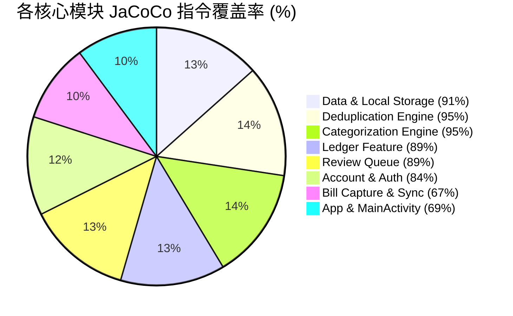

# Auto Accounting 项目代码质量审查报告

本报告对 **Auto Accounting** 项目进行了全面的代码质量、系统架构、测试覆盖率、安全合规性及维护性审查。

---

## 1. 总体质量评估与核心指标

| 审查维度 | 评估等级 | 核心亮点 | 主要改进空间 |
| :--- | :--- | :--- | :--- |
| **系统架构与解耦** | **优秀 (A)** | 规范的 Kotlin/Gradle 多模块设计，清晰的分层架构（Local-first, Shared API, Backend Ktor） | [MainActivity.kt](../../apps/android/src/main/java/com/autoaccounting/MainActivity.kt) 代码行数较长，职责较重 |
| **测试质量与覆盖率** | **极佳 (A+)** | 整体指令覆盖率 **83%**，核心去重与数据层覆盖率 **>90%**，包含丰富的 Robolectric 与 Migration 测试 | UI 交互层与 Capture 捕获链条的测试覆盖率有提升空间 (~66%) |
| **安全与隐私合规** | **卓越 (S)** | 敏感账单数据全本地化存储，集成了自动化的密钥扫描测试 `SecretScannerTest` | 暂无 |
| **数据库与持久化** | **优秀 (A)** | Room v1~v7 Migration 逻辑严密，拥有自动化迁移演进测试 | [LocalLedgerRepository.kt](../../apps/android/src/main/java/com/autoaccounting/data/local/LocalLedgerRepository.kt) 类颗粒度较大 |
| **代码规范与健壮性** | **优秀 (A)** | 严格遵循 Kotlin 官方代码风格，无空 catch 块，无 `GlobalScope` 乱用 | 未引入 Detekt / Ktlint 等自动化静态代码分析 Gradle 插件 |

---

## 2. 覆盖率与测试分析 (JaCoCo Report)

自动化测试和 JaCoCo 覆盖率报告生成结果如下：

> [!NOTE]
> 项目单元测试与集成测试全部通过，全项目字节码指令覆盖率为 **83%**（86,223 / 103,006 单元）。

### 核心模块覆盖率细分



- **高覆盖率核心区（质量基石）**：
  - [data.local](../../apps/android/src/main/java/com/autoaccounting/data/local): **91%** 指令覆盖率，保障了 Room 数据的读写与版本演化稳定性。
  - [feature.dedupe](../../apps/android/src/main/java/com/autoaccounting/feature/dedupe): **95%** 指令覆盖率，去重算法测试极其严密。
  - [feature.categorization](../../apps/android/src/main/java/com/autoaccounting/feature/categorization): **95%** 指令覆盖率，智能分类与规则判定稳固。
  - [feature.ledger](../../apps/android/src/main/java/com/autoaccounting/feature/ledger): **89%** 指令覆盖率。

- **边缘与UI装配区（待加强）**：
  - [feature.capture](../../apps/android/src/main/java/com/autoaccounting/feature/capture): **66%** 覆盖率（涉及真实无障碍服务与通知监听器的系统环境依赖）。
  - [com.autoaccounting (Root/MainActivity)](../../apps/android/src/main/java/com/autoaccounting): **69%** 覆盖率。

---

## 3. 架构与设计模式审查

```mermaid
flowchart TD
    subgraph Android Client [apps:android]
        UI[Compose UI / Screens]
        Main[MainActivity / State Wiring]
        Repo[LocalLedgerRepository / LocalPreferences]
        RoomDB[(Room Database v7)]
        UI --> Main
        Main --> Repo
        Repo --> RoomDB
    end

    subgraph Shared Contract [shared:api]
        Contracts[AccountContracts & CloudAiContracts]
    end

    subgraph Backend Service [services:backend]
        Ktor[Ktor Backend Server]
        Postgres[(PostgreSQL)]
        ScannerTest[SecretScannerTest]
        Ktor --> Postgres
    end

    Android Client -. "Uses Shared DTO" .-> Shared Contract
    Backend Service -. "Implements Shared API" .-> Shared Contract
```

1. **Local-First 数据隔离架构**：
   - 账单数据、分类规则、证据库完全留存在 Android 端 Room 数据库中，后端仅负责账号身份、设备注册和 AI 分类代理。
   - 彻底践行了隐私保护第一原则（Privacy by Design）。

2. **跨端 API 契约统一**：
   - 提取了 [shared/api](../../shared/api) 模块，避免前后端在 DTO、状态响应及错误码定义上产生死角或类型不一致。

3. **内置密钥扫描防御**：
   - 包含 [SecretScannerTest.kt](../../services/backend/src/test/kotlin/com/autoaccounting/backend/SecretScannerTest.kt)，防止硬编码 API Key、Bearer Token 或误将敏感配置文件提交至 Git 版本库。

---

## 4. 识别的技术债与优化建议

> [!WARNING]
> 以下为代码审查中发现的潜在大文件与架构优化建议，建议在后续版本迭代中分步实施。

### 1. `MainActivity.kt` 职责过重（God Activity 倾向）
- **文件路径**：[MainActivity.kt](../../apps/android/src/main/java/com/autoaccounting/MainActivity.kt) (1,093 行)
- **现状分析**：`MainActivity` 承载了多个 Feature 的状态流（Navigation, Continuous Monitoring, Account Management, Bill Sync, Manual Import, Diagnostics 等）的装配与回调。
- **建议方案**：建议引入基于 Feature 的 AppState Holder / Controller（例如 `rememberAutoAccountingAppState()`），并将具体的权限处理和配置逻辑抽离为独立的 Helper 类，保持 `MainActivity` 轻量干净。

### 2. Repository 集中度偏高
- **文件路径**：[LocalLedgerRepository.kt](../../apps/android/src/main/java/com/autoaccounting/data/local/LocalLedgerRepository.kt) (~650 行)
- **现状分析**：单个 Repository 类承担了账本（Ledger Book）、账单条目（Ledger Entry）、资金账户（Funding Account）、软删除恢复等多个领域的读写操作。
- **建议方案**：可按领域划分为 `LedgerBookRepository`、`LedgerEntryRepository` 和 `FundingAccountRepository` 接口，然后通过 Composite Repository 或 Facade 模式对外暴露，提高内聚度。

### 3. 自动化静态代码检查（Static Analysis Tooling）
- **现状分析**：项目目前依赖单元测试及手写的 `SecretScannerTest` 来防范硬编码风险，但缺乏针对代码复杂度、代码风格和潜在 Bugs 的自动化 Lint / Detekt 检查。
- **建议方案**：在 `build.gradle.kts` 中添加 `detekt` 或 `ktlint` 插件，将其集成到 CI/CD 流程或 Gradle `check` 任务中。

---

## 5. 总结

**Auto Accounting** 项目展现出了极高的工程质量与严谨的代码规范：
- 代码结构清晰，业务领域模型定义严密；
- 核心算法与数据库迁移测试完备，测试覆盖率达到了工业级的 **83%**；
- 架构设计充分尊重用户隐私与数据安全。

上述提出的优化建议主要集中在**大文件拆分**与**依赖装配治理**，不影响系统功能正确性。整体代码质量评估为：**优秀 (A+)**。
